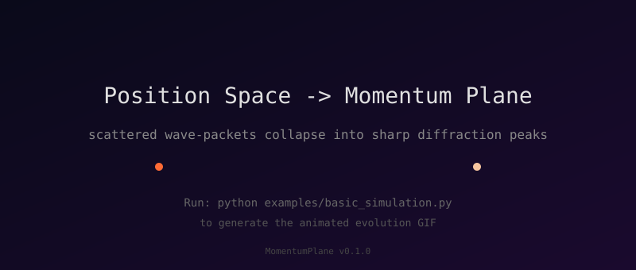
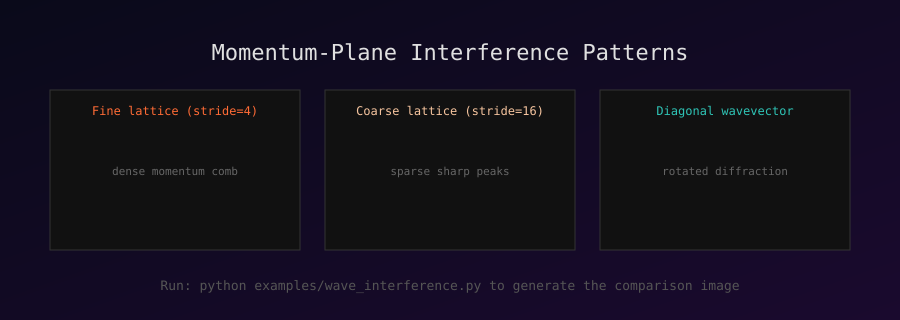
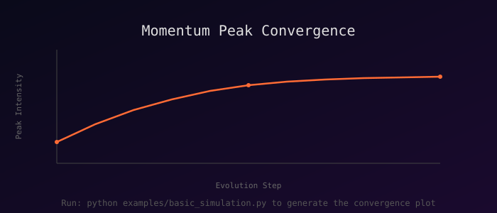

# 🌊 MomentumPlane — 动量平面引擎

> *"在动量空间的晶格上，每一次相干注入都是一次低语，每一次离散跳跃都是一次回响。当无数低语在傅里叶的尽头相遇，它们汇聚成光。"*

A physics-inspired high-performance simulation framework for **periodic coherent injection** and **discrete quantum hopping** on momentum-space lattices. Inspired by quantum optics, discrete-time quantum walks, and the breathtaking diffraction patterns that emerge when order meets interference.

---

## ✨ What does it look like?

**Position Space → Momentum Plane** — watch scattered wave-packets collapse into sharp diffraction peaks:



**Different injection lattices produce different momentum-space crystals:**



**Peak convergence over evolution steps:**



> **Generate the real thing:** Run `python examples/basic_simulation.py` to produce high-resolution PNG heatmaps and an animated GIF. Run `python examples/wave_interference.py` for the three-panel comparison. The SVGs above are placeholders that render instantly on GitHub.

---

## 🧠 The Physics in 30 Seconds

1. **Inject** — Place coherent Gaussian wave-packets at regular spatial intervals (a sub-lattice), all sharing the same momentum direction. This is your "source."

2. **Hop** — Evolve the wavefunction via a **discrete-time quantum walk (DTQW)**: each step applies a Hadamard (or Grover) coin operator followed by a conditional shift. The walker delocalises, carrying phase information across the lattice.

3. **Transform** — Take the 2D FFT. The regular injection sites act like a diffraction grating: in momentum space you get a **comb of sharp peaks** whose positions, widths, and relative intensities encode the injection geometry and the quantum-walk dynamics.

4. **Converge** — As the quantum walk progresses, phases re-align and the momentum peaks sharpen, split, or form caustic-like structures. This is the "momentum plane" — a visual fingerprint of the underlying physics.

---

## 🚀 Quick Start

```bash
# Clone
git clone https://github.com/eninem123/MomentumPlane.git
cd MomentumPlane

# Install dependencies
pip install -r requirements.txt

# Run a basic simulation (generates PNG + GIF in assets/)
python examples/basic_simulation.py

# Launch the interactive dashboard
streamlit run app.py
```

### Minimal Example (10 lines)

```python
from momentum_plane import MomentumPlanePipeline, SimulationConfig

cfg = SimulationConfig(grid_size=64, stride=8, n_steps=30, seed=42)
result = MomentumPlanePipeline(cfg).run()

print(f"Final momentum peaks detected: {result['n_peaks'][-1]}")
print(f"Peak intensity: {result['peak_intensities'][-1]:.4f}")
```

---

## 🏗️ Architecture

```
MomentumPlane/
├── momentum_plane/
│   ├── injector.py      # 📡 Periodic coherent wave-packet injection
│   ├── lattice.py       # 🔀 Discrete-time quantum walk (Hadamard/Grover coin + shift)
│   ├── synthesizer.py   # 💫 2D FFT momentum-plane synthesis + peak detection
│   ├── visualizer.py    # 🎨 Heatmaps, phase portraits, animated GIFs
│   └── pipeline.py      # ⚡ End-to-end orchestration (Injector → Lattice → Field → Viz)
├── examples/
│   ├── basic_simulation.py
│   └── wave_interference.py
├── tests/               # 24 unit tests (unitarity, Parseval, reproducibility...)
├── docs/                # Theory derivation notes
├── app.py               # Streamlit interactive dashboard
└── requirements.txt
```

### Module Responsibilities

| Module | Physics | Code |
|--------|---------|------|
| **Injector** | Coherent wave-packet superposition | Gaussian envelope × plane-wave phase, placed on sub-lattice |
| **LatticeHop** | DTQW unitary evolution | 4-direction coin (C⁴) + conditional shift, periodic/reflective BC |
| **FieldPlane** | Momentum-space diffraction | 2D FFT + fftshift, apodisation windows, peak finding |
| **Visualizer** | Scientific visualisation | Log-scale heatmaps, phase portraits, FuncAnimation GIFs |

---

## 🎛️ Interactive Dashboard

The Streamlit app (`app.py`) lets you tune every physical parameter in real time:

- **Injector:** grid size, injection stride, wavevector (kx, ky), packet width, phase jitter
- **LatticeHop:** evolution steps, coin type (Hadamard/Grover), coin phase bias, boundary condition
- **Display:** record interval, phase map toggle

Drag the sliders, hit **Run**, and watch the momentum plane respond.

```bash
streamlit run app.py
```

---

## 📊 Key Features

- **Physically rigorous** — unitary evolution verified, Parseval energy conservation tested
- **Two coin operators** — Hadamard (balanced) and Grover (diffusion), with optional chiral phase bias
- **Flexible boundaries** — periodic (torus) or reflective
- **Momentum peak detection** — automatic local-maximum finding with non-maximum suppression
- **Reproducible** — seeded RNG for all stochastic elements
- **24 unit tests** — covering unitarity, energy conservation, shape contracts, determinism
- **Interactive web UI** — Streamlit dashboard with live parameter tuning
- **Animated GIF export** — perfect for papers, presentations, and showing off

---

## 📐 Theory Notes

See [`docs/theory.md`](docs/theory.md) for the full derivation:

- The momentum-space amplitude of N coherently injected packets
- Why regular injection → diffraction grating → momentum comb
- DTQW dispersion relation and its effect on peak broadening
- Phase jitter as a decoherence parameter

---

## 🛣️ Roadmap

- [ ] **Rust core** — rewrite `lattice.py` evolution loop in Rust with PyO3 bindings (10-50x speedup)
- [ ] **GPU acceleration** — CuPy backend for large grids (256×256 and above)
- [ ] **3D extension** — momentum volume rendering for 3D lattices
- [ ] **QuTiP integration** — compare DTQW results with master-equation open quantum systems
- [ ] **Live web demo** — deploy Streamlit app to Community Cloud
- [ ] **C++ reference implementation** — for HPC clusters

---

## 🤝 Contributing

Contributions are welcome! Whether it's a new coin operator, a faster FFT backend, a beautiful visualisation, or a theory correction — open an issue or PR.

1. Fork the repo
2. Create a feature branch
3. Add tests for new functionality
4. Ensure `pytest tests/` passes
5. Open a PR

---

## 📄 License

[MIT](LICENSE) — use it, break it, build on it.

---

## 🙏 Acknowledgements

Inspired by the beauty of quantum optics, the elegance of discrete-time quantum walks, and the profound truth that **interference is just order meeting itself in Fourier space.**

---

<div align="center">

**If this made you feel something, give it a ⭐**

*Built with NumPy, SciPy, Matplotlib, and a lot of late-night physics.*

</div>
