<div align="right">

[**English**](README.md) | [简体中文](README.zh-CN.md)

</div>

<div align="center">

[](https://github.com/eninem123/MomentumPlane/actions/workflows/ci.yml)
[](https://opensource.org/licenses/MIT)
[](https://www.python.org/downloads/)
[](https://github.com/google/jax)
[](https://github.com/astral-sh/ruff)
[](https://colab.research.google.com/github/eninem123/MomentumPlane/blob/main/examples/momentum_plane_demo.ipynb)

</div>

# 🌊 MomentumPlane

> *"On the lattice of momentum space, every coherent injection is a whisper, every discrete hop an echo. When countless whispers meet at the end of Fourier, they converge into light."*

A physics-inspired high-performance simulation framework for **periodic coherent injection** and **discrete quantum hopping** on momentum-space lattices. Inspired by quantum optics, discrete-time quantum walks, and the breathtaking diffraction patterns that emerge when order meets interference.

---

## ✨ What does it look like?

**Position Space → Momentum Plane** — watch scattered wave-packets collapse into sharp diffraction peaks (diagonal wavevector, 6 momentum peaks):

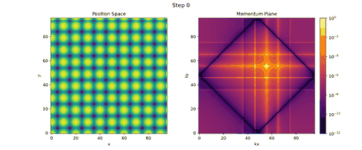

**Final state — position density (left) vs momentum-plane intensity (right):**

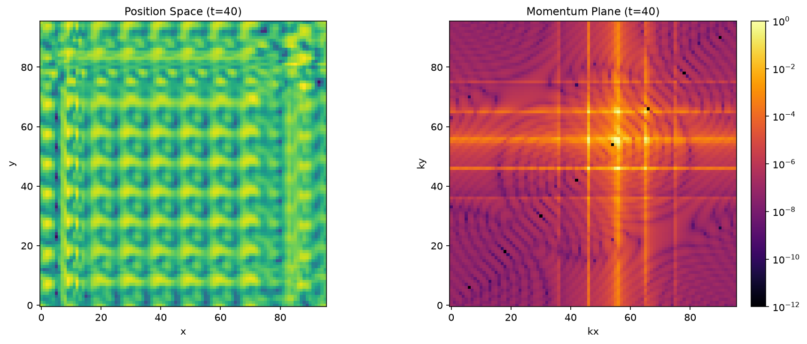

**Peak convergence over evolution steps:**

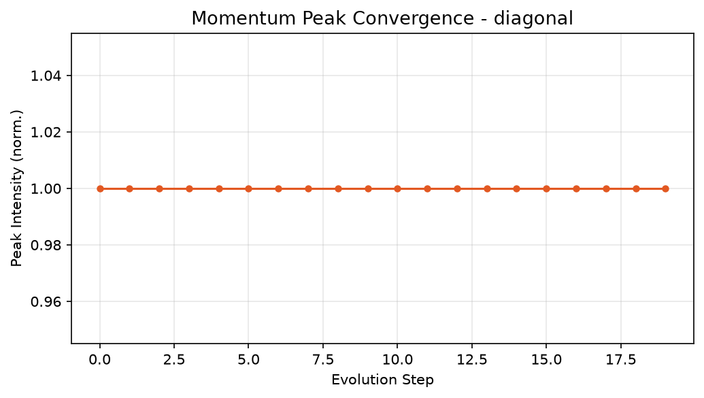

**Four different physics regimes — classic, diagonal, Grover, and chiral:**

| Classic Hadamard | Diagonal Wavevector | Grover Coin | Chiral Bias |
|---|---|---|---|
| 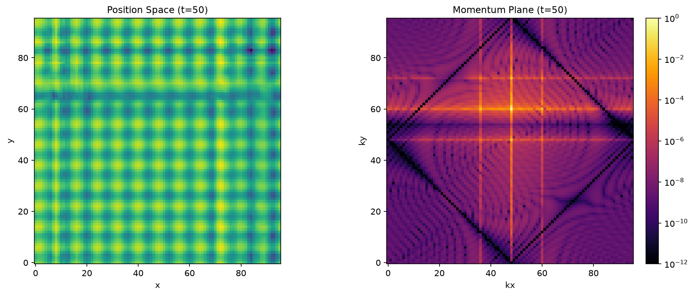 |  | 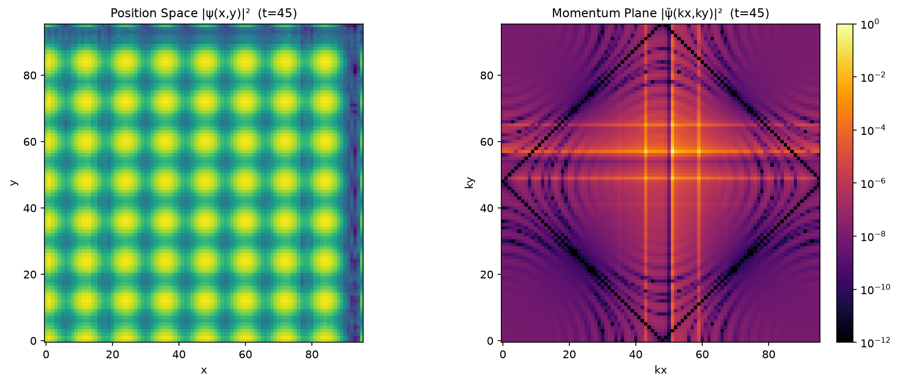 | 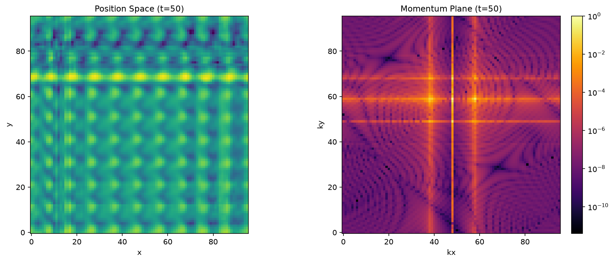 |

> **Assets are auto-generated** by GitHub Actions on every push. Run `python examples/generate_demo_assets.py` locally to produce high-resolution versions.

---

## 🧠 The Physics in 30 Seconds

1. **Inject** — Place coherent Gaussian wave-packets at regular spatial intervals (a sub-lattice), all sharing the same momentum direction. This is your "source."

2. **Hop** — Evolve the wavefunction via a **discrete-time quantum walk (DTQW)**: each step applies a Hadamard (or Grover) coin operator followed by a conditional shift. The walker delocalises, carrying phase information across the lattice.

3. **Transform** — Take the 2D FFT. The regular injection sites act like a diffraction grating: in momentum space you get a **comb of sharp peaks** whose positions, widths, and relative intensities encode the injection geometry and the quantum-walk dynamics.

4. **Converge** — As the quantum walk progresses, phases re-align and the momentum peaks sharpen, split, or form caustic-like structures. This is the "momentum plane" — a visual fingerprint of the underlying physics.

---

## 🚀 Quick Start

```bash
# Clone
git clone https://github.com/eninem123/MomentumPlane.git
cd MomentumPlane

# Install dependencies
pip install -r requirements.txt

# Run a basic simulation (generates PNG + GIF in assets/)
python examples/basic_simulation.py

# Launch the interactive dashboard
streamlit run app.py
```

### Minimal Example (10 lines)

```python
from momentum_plane import MomentumPlanePipeline, SimulationConfig

cfg = SimulationConfig(grid_size=64, stride=8, n_steps=30, seed=42)
result = MomentumPlanePipeline(cfg).run()

print(f"Final momentum peaks detected: {result['n_peaks'][-1]}")
print(f"Peak intensity: {result['peak_intensities'][-1]:.4f}")
```

---

## 🏗️ Architecture

```
MomentumPlane/
├── momentum_plane/
│   ├── injector.py      # Periodic coherent wave-packet injection
│   ├── lattice.py       # DTQW (Hadamard/Grover coin + shift) — NumPy backend
│   ├── lattice_jax.py   # DTQW — JAX backend (jit, GPU, autodiff, vmap)
│   ├── boundary.py      # Geometric boundary masks (ring, polygon, strip, custom)
│   ├── inverse_design.py # Gradient-based inverse design (JAX autodiff + Adam)
│   ├── synthesizer.py   # 2D FFT momentum-plane synthesis + peak detection
│   ├── visualizer.py    # Heatmaps, phase portraits, animated GIFs
│   └── pipeline.py      # End-to-end orchestration (backend: numpy/jax)
├── examples/
│   ├── basic_simulation.py
│   ├── benchmark.py          # NumPy vs JAX performance benchmark
│   ├── boundary_demo.py      # Topological boundary confinement demo
│   ├── inverse_design_demo.py # Inverse design optimization demo
│   ├── generate_demo_assets.py
│   ├── momentum_plane_demo.ipynb  # Google Colab notebook
│   └── wave_interference.py
├── tests/               # 76 unit tests (unitarity, Parseval, NumPy/JAX parity, boundary, inverse design...)
├── docs/                # Theory derivation notes
├── .github/workflows/   # Auto-generate demo assets via GitHub Actions
├── app.py               # Streamlit interactive dashboard
└── requirements.txt
```

### Module Responsibilities

| Module | Physics | Code |
|--------|---------|------|
| **Injector** | Coherent wave-packet superposition | Gaussian envelope x plane-wave phase, placed on sub-lattice |
| **LatticeHop** | DTQW unitary evolution | 4-direction coin (C^4) + conditional shift, periodic/reflective BC |
| **FieldPlane** | Momentum-space diffraction | 2D FFT + fftshift, apodisation windows, peak finding |
| **Visualizer** | Scientific visualisation | Log-scale heatmaps, phase portraits, FuncAnimation GIFs |

---

## 🎛️ Interactive Dashboard

The Streamlit app (`app.py`) lets you tune every physical parameter in real time:

- **Injector:** grid size, injection stride, wavevector (kx, ky), packet width, phase jitter
- **LatticeHop:** evolution steps, coin type (Hadamard/Grover), coin phase bias, boundary condition
- **Display:** record interval, phase map toggle

Drag the sliders, hit **Run**, and watch the momentum plane respond.

```bash
streamlit run app.py
```

---

## 🔷 Topological Boundary Confinement

Inspired by **topological photonics** — where waves propagate defect-immune along lattice edges — MomentumPlane supports geometric boundary masks that trap the quantum walk inside specific shapes.

```python
from momentum_plane import MomentumPlanePipeline, SimulationConfig

# Ring (annular waveguide)
cfg = SimulationConfig(
    grid_size=96, n_steps=35, seed=42,
    boundary_mask={"shape": "ring", "inner_radius": 15, "outer_radius": 35},
)
result = MomentumPlanePipeline(cfg).run()

# Hexagonal cavity
cfg = SimulationConfig(
    boundary_mask={"shape": "polygon", "n_sides": 6, "radius": 30},
)

# Other shapes: circle, triangle, square, strip (horizontal/vertical), or custom boolean mask
```

| Free Propagation | Ring Confinement | Hexagon Cavity | Triangle Cavity |
|---|---|---|---|
| 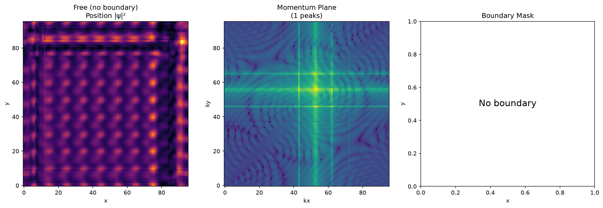 | 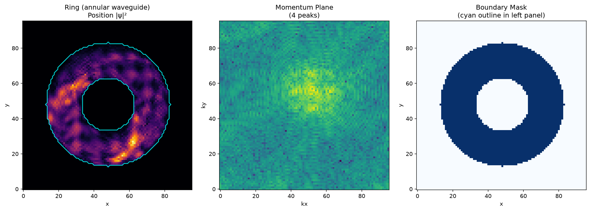 | 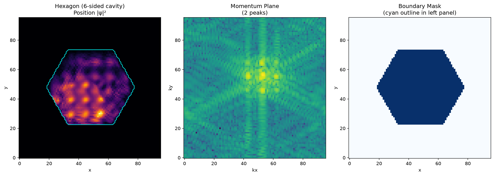 | 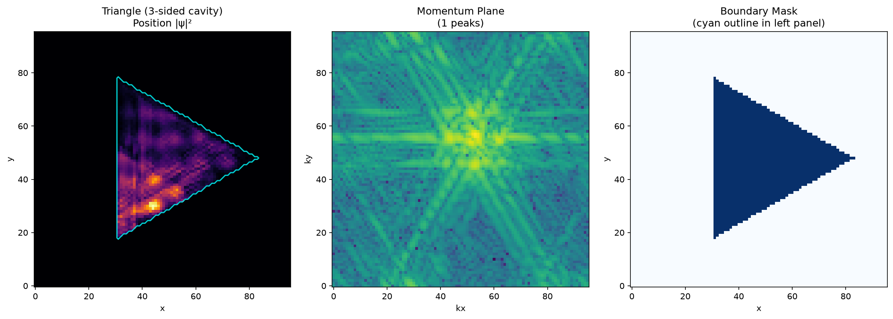 |

> The cyan outline in each left panel shows the boundary mask. Run `python examples/boundary_demo.py` to regenerate all four comparisons.

---

## 🎯 Inverse Design (Gradient-Based)

Instead of simulating forward from known parameters, **specify the desired momentum plane and let the optimizer find the injection parameters**. The entire pipeline — injection → DTQW → FFT → intensity — is fully differentiable via JAX, so gradients flow end-to-end.

```python
from momentum_plane.inverse_design import optimize, target_with_peaks, InverseDesignConfig

# 1. Define your target (e.g., two peaks at specific momentum coordinates)
target = target_with_peaks(64, [(20, 24), (44, 24)], peak_sigma=4.0)

# 2. Optimize injection parameters (kx, ky, sigma, phase_offset) via Adam
cfg = InverseDesignConfig(grid_size=64, stride=8, n_steps=20, n_iter=200, lr=0.02)
result = optimize(target, cfg)

# 3. Inspect the solution
print(result.params)       # {'kx': ..., 'ky': ..., 'sigma': ..., 'phase_offset': ...}
print(result.loss_history) # convergence curve
```

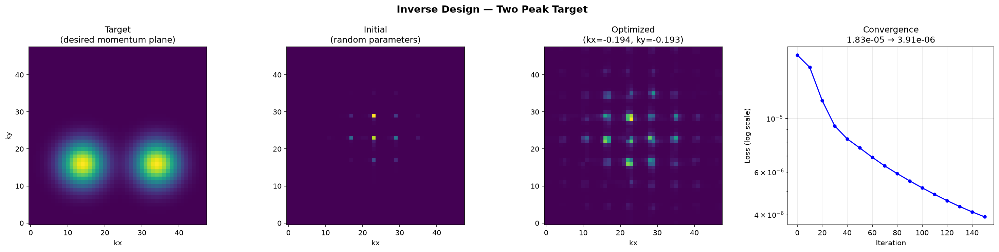

> The optimizer discovers wavevectors and packet widths that reproduce arbitrary target distributions. Supports both MSE and correlation loss functions. Run `python examples/inverse_design_demo.py` for a full demo with peak and ring targets.

---

## 📊 Key Features

- **Physically rigorous** — unitary evolution verified, Parseval energy conservation tested
- **Two coin operators** — Hadamard (balanced) and Grover (diffusion), with optional chiral phase bias
- **Flexible boundaries** — periodic (torus) or reflective
- **Topological confinement** — geometric boundary masks (ring, polygon, strip, custom) trap the quantum walk, inspired by topological photonics
- **Inverse design** — fully differentiable pipeline (JAX autodiff) + Adam optimizer; specify target momentum, recover injection parameters
- **Momentum peak detection** — automatic local-maximum finding with non-maximum suppression
- **Reproducible** — seeded RNG for all stochastic elements
- **76 unit tests** — covering unitarity, energy conservation, shape contracts, NumPy/JAX parity, boundary confinement, gradient flow, optimization convergence
- **Interactive web UI** — Streamlit dashboard with live parameter tuning
- **Animated GIF export** — perfect for papers, presentations, and showing off
- **CI/CD** — ruff linting + pytest-cov coverage + auto asset generation on every push

---

## 📐 Theory Notes

See [`docs/theory.md`](docs/theory.md) for the full derivation:

- The momentum-space amplitude of N coherently injected packets
- Why regular injection -> diffraction grating -> momentum comb
- DTQW dispersion relation and its effect on peak broadening
- Phase jitter as a decoherence parameter

---

## 🛣️ Roadmap

- [ ] **Rust core** — rewrite `lattice.py` evolution loop in Rust with PyO3 bindings (10-50x speedup)
- [ ] **GPU acceleration** — CuPy backend for large grids (256x256 and above)
- [ ] **3D extension** — momentum volume rendering for 3D lattices
- [ ] **QuTiP integration** — compare DTQW results with master-equation open quantum systems
- [ ] **Live web demo** — deploy Streamlit app to Community Cloud
- [ ] **C++ reference implementation** — for HPC clusters

---

## 🤝 Contributing

Contributions are welcome! Whether it's a new coin operator, a faster FFT backend, a beautiful visualisation, or a theory correction — open an issue or PR.

1. Fork the repo
2. Create a feature branch
3. Add tests for new functionality
4. Ensure `pytest tests/` passes
5. Open a PR

---

## 📄 License

[MIT](LICENSE) — use it, break it, build on it.

---

## 🙏 Acknowledgements

Inspired by the beauty of quantum optics, the elegance of discrete-time quantum walks, and the profound truth that **interference is just order meeting itself in Fourier space.**

---

<div align="center">

**If this made you feel something, give it a ⭐**

*Built with NumPy, SciPy, Matplotlib, and a lot of late-night physics.*

</div>
